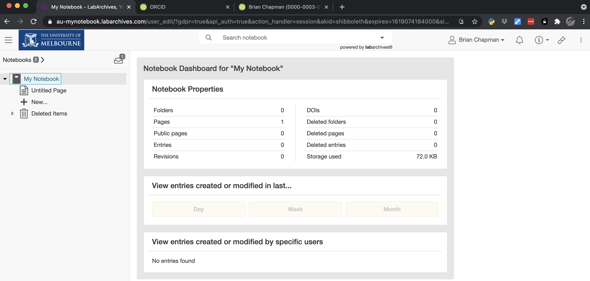
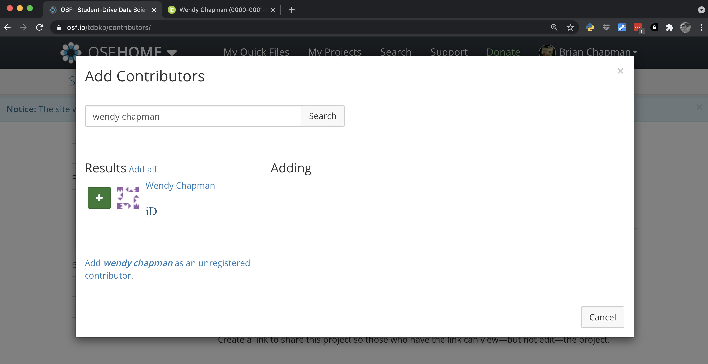
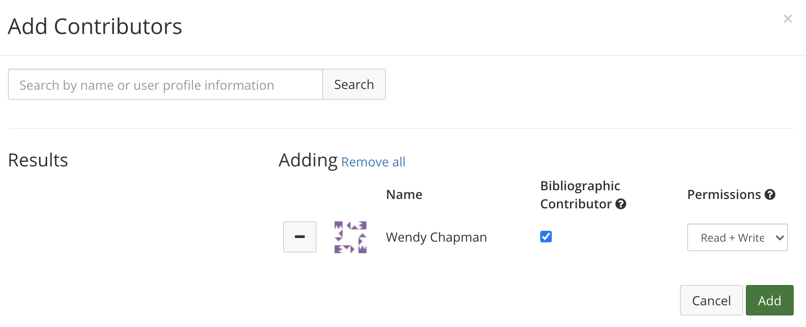

# Tools for Collaborative Data Science

As you embark on a collaborative data science project, what should be the objectives that guide your selection of tools?

1. Remain "friends"  with all your collaborators
1. Record the steps you take in such a way that you can
    a. Support any claims of intellectual property
    b. Demonstrate scientific integrity
    c. Understand and explain the choices you made
1. Replicate your own results
    a. Allow others to replicate your results
1. Recover from catastrophes

## "Remain 'friends'..."

This requires using good communication tools like Slack and perhaps project management software like Trello. And following good practices, as I try to outline below.

## "Record the steps..."

This is the requirements of a scientific "lab notebook" and can be achieved with a traditional notebook. However, in collaborative research it may be beneficial to use a resource that all collaborators can see and edit.

The University of Melbourne (as well as Monash and La Trobe) subscribe to [LabArchives](https://au-auth-app.labarchives.com/select_institution)

Since your LabArchives notebooks are connected to your university account, you will lose access when you leave the institution.

For alternatives,[here](https://www.nature.com/articles/d41586-018-05895-3) is a _Nature_ article on how to select an electronic lab notebook (ELN).

I use [Open Science Framework (OSF)](https://osf.io/).

### Activity

__Create an OSF notebook and invite your partner as a collaborator.__

----------------

If you want to learn more, OSF has an hour-long tutorial on YouTube about how to optimally use their resources.

<iframe width="560" height="315" src="https://www.youtube.com/embed/dLEIhJESIQA" title="YouTube video player" frameborder="0" allow="accelerometer; autoplay; clipboard-write; encrypted-media; gyroscope; picture-in-picture" allowfullscreen></iframe>

## "Replicate your own results"

Replicating your own results relies on version control (both for your code and your data), precisely defining the environment within which your computations occur.

Here are some excerpts from the book _The Practice of Reproducible Research: Case Studies and Lessons from the Data-Intensive Sciences_ that illustrate the idea of reproducibility in computational domains.

> A research project is computationally reproducible if a second investigator (including you in the future) can re-create the final reported results of the project, including key quantitative findings, tables, and figures, given only a set of files, and written instructions (_The Practice of Reproducible Research_, p. xxii)

>A crucial component of the chain of evidence is the software used to process and analyze the data. Modern data analysis typically involves dozens, if not hundreds of steps, each of which can be performed by numerous algorithms __that are nominally identical but differ in detail,__ and each of which involves at least some ad hoc choices. (_The Practice of Reproducible Research_, p. xix)

>Using point-and-click tools, rather than scripted analyses, makes it easier to commit errors and harder to find them. One recent calamity attributable in part to poor computational practice is the work of Reinhart and Rogoff (2010), which was used to justify economic austerity measures in southern Europe. Errors in their Excel spreadsheet led to the wrong conclusion (Herndon et al., 2014). If they had scripted their analysis and tested the code instead of using spreadsheet software, their errors might have been avoided, discovered, or corrected before harm was done. (_The Practice of Reproducible Research_, p. xix)

From the same book, here are the editors "Three Key Practices" for reproducible data science (_The Practice of Reproducible Research_, p. 20)

1. Clearly separate, label, and document all data, files, and operations that occur on data and files.
1. Document all operations fully, __automating them as much as possible,__ and avoiding manual intervention in the workflow when feasible.
1. Design a workflow as a sequence of small steps that are glued together, with intermediate outputs from one step feeding into the next step as inputs.

### Improving Reproducibility By Using Version Control

- Git Tutorial

### Improving Reproducibility by Using Data Versioning

- DVC tutorial

### Improving Reproducibility by Defining Computational Environments

- Docker
- 
Data Version Control (DVC)

##
